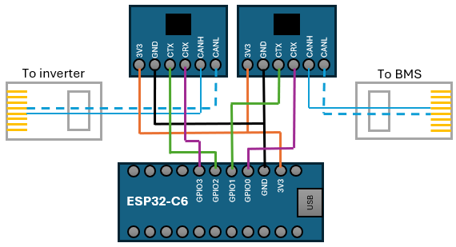

# mitpylon
Man In The Middle Adapter For Pylontech Communction Protocol

# WARNING
I'm not responsible for any damaged caused by this software.

Use it at your own risk!

# Idea behind it
A lot of BMSes talk Pylontech Protocol to Inverter.

It's interesting to read values to show it in a SmartHome System like Home Assistant.

But sometimes it is also useful to modify some values, like charging current or voltage.

This ESPHome YAML reads CAN messages from BMS on one CAN-interface and resends (modified) messages to an inverter on the second CAN interface.

# Features
- Modify charge current: from 0 amps to the values that BMS allows
- Modify discharge current: from 0 amps to the values that BMS allows
- Set offset to charge voltage (default 0.5V) to compensate voltage drop or fix voltage issues on some inverters, like Deye SUN12K
- Set charge limit to SoC 90% and automaticaly charge to 100% on each sunday for balancing
- Enable/Disable charging
- Enable/Disable discharging
- Control SoC 100% (don't send 100% to inverter until float voltage state is reached)

# Limitations
Only this messages of original Pylontech Protocol are sopported:
0x351, 0x355, 0x356, 0x359, 0x35c, 0x35e

# Requirments
This YAML was tested on ESP32 C6 with 2 CAN-Bus transceiver and modified ESPHome esp32_can component, to handle 2x internal CAN-busses

It should be possible to use any ESP32 with one CAN-Bus transceiver and one MCP2515 SPI CAN-Controller (not tested)

Tested with JK Inverter BMS and Deye SUN12K Inverter
